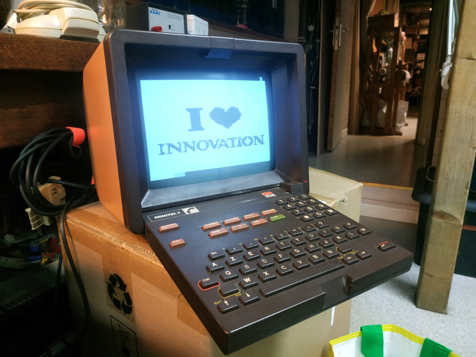
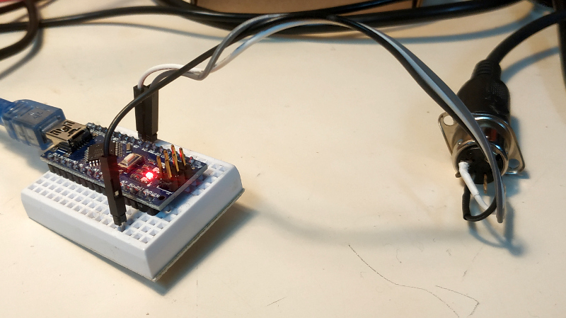

# Minitel forever

Programmes pour arduino + minitel

**png_to_minitel**

Conversion d'images PNG 80x72 1-bit en tableau d'octets pour afficher sur le minitel. Ces tableaux sont réutilisables dans les programmes arduino.

**videotex_lpl_004**

Diaporama auto-promotionnel et innovant pour 2022

**Manque le schéma du circuit très simple**

En attendant : relier le cable MIDI aux broches suivantes (vue de l'arrière de l'embase, de gauche à droite)

    1: arduino digital 7
    2: NC
    3: arduino gnd
    4: NC
    5: arduino digital 6

Pour la compatibilité du futur incertain, les lib. arduino sont dans le dossier ./LIB

